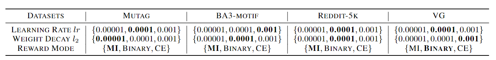

# Reinforced Causal Explainer for Graph Neural Networks

PyTorch implementation for *Reinforced Causal Explainer for Graph Neural Networks*

Xiang Wang, Yingxin Wu, An Zhang,  Fuli Feng, Xiangnan He and Tat-Seng Chua

In TPAMI.


## Dependencies & Dataset

* Please refer to *environment.yml* for environment setup and https://drive.google.com/file/d/1Cv2PBj4Tqcx-FzSO_wdQSletIxwof0IZ/view?usp=sharing to download dataset.


## Reproductivity

To reproduce the results in our paper, simply run 

```
bash running_mutag.sh
```

```
bash running_vg.sh
```

```
bash running_reddit5k.sh
```

Hyper-parameter settings are shown below:


